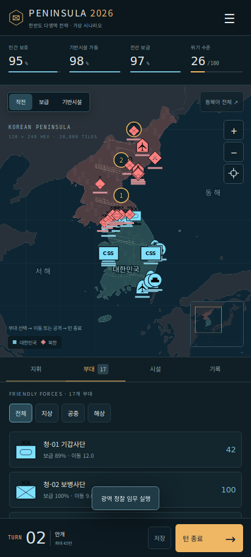

# PENINSULA 2026

[Android APK 다운로드](https://github.com/kingarthurhkm-oss/MTM/raw/refs/heads/main/downloads/peninsula-2026-debug.apk) · [소스 ZIP](https://github.com/kingarthurhkm-oss/MTM/archive/refs/heads/main.zip) · [오프라인 HTML](downloads/peninsula-2026-v3.html)



한반도를 배경으로 하는 **오프라인 Android 턴제 전략 게임**입니다. 대한민국 진영에서 육·해·공 전력과 보급을 지휘하고, 세 통제 구역을 확보하며 민간 보호와 기반시설 보존 목표를 달성합니다.

2026년은 시나리오 배경입니다. 기본 시나리오는 **공개 육군 편제**로, 공개 부대명과 시군 대표 게임 권역을 사용합니다. 기존 가상 편제는 새 시나리오 메뉴의 호환 선택지로 유지합니다. 전투력·시설·지원전력·적군·작전·피해 수치는 가상이며 실제 전쟁 예측값이 아닙니다.

**육군 데이터 확장:** 지휘부 12개, 사단 33개, 독립 전투여단 22개를 편제표로 제공하며 새 게임에서 55개 부대를 기본으로 조작할 수 있습니다. [데이터 구조·편제·출처·미수록 범위](docs/ARMY-DATA.md), [스탯 산정 규칙](docs/ARMY-STATS.md), [추가 검증 기록](docs/ARMY-VALIDATION.md)을 참고하세요. [육군 확장 오프라인 HTML](downloads/peninsula-2026-v3.html)은 v3(240×480, 115,200타일)입니다. 구형 120×240 HTML은 삭제했습니다. 기존 APK는 이전 빌드입니다.

## 구현 범위

| 항목 | 구현 |
|---|---|
| 진영 | 대한민국 플레이어 / 북한 AI |
| 지도 | 240열 × 480행, 115,200개 헥스 |
| 지리 범위 | 동경 118–147도, 북위 24–46도. 오키나와와 홋카이도 포함 |
| 플레이 가능 영역 | 남·북한 육지와 지도 내 해역. 외국 육지는 표시 전용 |
| 지상 | 보병·기계화·기갑, 포병·방공여단, 전선 보급대; 공개 육군 편제가 기본 |
| 공중 | 전투비행단의 공중 방어·광역 정찰·지상 지원·전투 출격 |
| 해상 | 해군전단 전투, 수송선단 승선·하선·물자 전달 |
| 정보 영역 | 통신 장애, 통신 방어, 정찰 가시성 |
| 기반시설 | 가상 전력·통신·항만·철도·도로·공항·에너지 거점 42곳 |
| 시설 피해 | 0–100% 가동률과 부분 복구. 이동·보급·출격·지휘점에 영향 |
| 보급 | 통제 지역의 경로 탐색, 지형·도로 피해·철도·전력·연료 효율, 적재량이 있는 보급대 |
| 전투 | 공격/방어 비율과 6면체 주사위, 지형·방어 태세·지원·보급 페널티 |
| 원거리 위협 | 장거리 화력·미사일의 추상 이벤트와 방공 차단 |
| 핵 위협 | 위기 지수에 따른 추상 재난 이벤트. 위치·탄두·폭발·피해 반경 계산 없음 |
| 결과 | 구역 통제, 민간 보호·시설 보존 지수, 전력 손실·소요 턴 점수 |
| 저장 | 명령 후 자동 저장, JSON 가져오기·내보내기, Android 파일 선택기 |
| 화면 | 한글, 세로/가로 반응형, 지도 이동·확대·미니맵·레이어·부대 목록 |

## 설치 및 실행

Android 8.0(API 26) 이상에서 설치하는 앱입니다. Android System WebView를 최신 상태로 유지하세요. 앱은 실행에 네트워크를 요구하지 않으며 인터넷 권한·위치 권한·광범위한 저장소 권한을 선언하지 않습니다.

1. 제공된 `peninsula-2026-debug.apk` 또는 GitHub Actions의 `app-debug.apk`를 기기로 내려받습니다.
2. 파일을 열고 Android 설치 화면을 진행합니다. 해당 다운로드 앱의 외부 APK 설치 허용이 필요할 수 있습니다.
3. 시작 안내의 **작전 시작**을 누릅니다.

디버그 서명 APK는 직접 설치·테스트용입니다. Google Play 게시용으로는 소유자의 서명 키를 사용해 별도 릴리스를 빌드해야 합니다. 새 디버그 키로 빌드한 APK가 기존 설치에 업데이트되지 않을 때는 먼저 게임 저장 JSON을 내보내고 기존 앱을 삭제한 뒤 설치하세요.

소스의 `dist/peninsula-2026-v3.html`은 단일 파일 오프라인 동반 버전입니다. 데스크톱 브라우저에서 직접 열어 플레이할 수 있습니다. 브라우저와 APK의 저장 공간은 별개이며 JSON으로 진행을 옮길 수 있습니다.

## 조작

- 부대 선택 → **이동 명령** → 지도 터치. 먼 목적지는 이번 턴 이동력만큼 진행합니다.
- **공격 대상 선택** → 적 부대 → 예상 전투비 확인 → **전투 실행**.
- 비행단은 턴마다 한 번 출격합니다. 방공여단은 주변을 자동 방어합니다.
- 가동률 25% 이상인 아군 항만에 지상부대를 배치하고, 인접 수송선단에서 **승선**합니다. **하선**은 인접한 아군 해안에서 가능합니다. 수송선단은 한 부대를 수송합니다.
- 보급대와 수송선단은 3헥스 이내 아군에 적재 물자를 전달합니다. 충분한 공급에 연결되면 예비 보급에서 물자를 재적재합니다.
- **시설**에서 피해 시설을 선택해 복구합니다. 복구마다 지휘점 2와 자재 12를 소모하고 가동률 28%p를 회복합니다.
- 지휘 패널에서 민간 보호, 위기 완화, 통신 방어, 예비 보급을 선택합니다. 각 정책은 한 턴에 한 번 가능합니다.
- 지도는 드래그, 핀치, 휠, 확대 버튼을 지원합니다. 부대 목록을 이용하면 작은 기호를 직접 누르지 않고 선택할 수 있습니다.
- **턴 종료** 시 AI 행동 → 위협 이벤트 → 보급·회복 → 구역 유지 판정 → 자원·기상 갱신이 진행됩니다.

## 목표와 점수

세 구역을 모두 2턴 연속 통제하면 시나리오가 종료됩니다. 민간 보호 70% 이상, 기반시설 60% 이상이면 보존 목표도 달성합니다. 보호 40% 미만, 시설 30% 미만, 지상 전력 전멸, 45턴 초과 시 실패합니다.

점수 = 보호 지수 × 35 + 시설 지수 × 30 + 결속 지수 × 10 + 남은 턴 × 35 − 아군 전력 손실 × 0.2.

손실은 추상 전력 감소이며 사망자 수가 아닙니다. 턴 길이와 헥스 이동 수는 현실 시간·거리로 환산하지 않습니다. 승리 판정은 세 구역 통제 규칙이며 북한 전 영토의 타일별 점령 판정과 다릅니다.

## 소스 빌드

필요 환경: JDK 17, Android SDK Platform 35 / Build Tools 35.0.0, Gradle 8.11.1, Node.js 22 이상. Android Gradle Plugin은 8.9.2입니다.

```sh
python3 tools/build-army-data.py
npm test
python3 tools/build-standalone.py
./gradlew assembleDebug lintDebug
```

로컬 SDK 경로는 개인 `local.properties`의 `sdk.dir` 또는 `ANDROID_HOME`으로 설정합니다. `local.properties`와 서명 키는 커밋하지 않습니다. 빌드 결과는 `app/build/outputs/apk/debug/app-debug.apk`입니다.

```sh
npm run preview
# 브라우저에서 http://127.0.0.1:8080 열기
```

GitHub Actions의 **Android game build** 워크플로는 푸시/PR/수동 실행 시 규칙 테스트, Android 빌드와 lint를 실행하고 설치 파일과 단일 HTML을 artifact로 제공합니다. artifact는 30일간 보존하도록 설정되어 있습니다. Release 게시나 Google Play 업로드를 자동 수행하지 않습니다.

## 구조

```text
app/src/main/assets/game/  지도·엔진·화면·기호
app/src/main/java/         Android WebView와 JSON 파일 가져오기/내보내기
tests/                    규칙·저장·전투·수송 검증
tools/                    지리 데이터와 단일 HTML 생성
docs/                     설계, 출처, 검증 기록
.github/workflows/        Android 자동 빌드
```

## 자료 출처 및 한계

- [Natural Earth 1:50m 지도](https://www.naturalearthdata.com/downloads/50m-cultural-vectors/50m-admin-0-countries/)를 [world-atlas 2.0.2](https://github.com/topojson/world-atlas) 형식으로 사용합니다. 지리 데이터는 public domain이며 정치적·법적 경계 판단용이 아닙니다.
- 작은 한국 부속도서는 타일 해상도에서 보이도록 일부를 한 헥스로 보강했습니다. 해안선과 격자는 완전히 일치하지 않으며, 지도 범위를 고정 격자에 맞추기 위해 헥스는 가로로 넓게 표시됩니다.
- 한글 글꼴은 Noto Sans KR의 Korean subset을 오프라인 번들로 포함합니다. SIL Open Font License 고지는 `app/src/main/assets/game/fonts/OFL.txt`에 있습니다.
- [milsymbol](https://github.com/spatialillusions/milsymbol) 3.0.3의 APP6 모드로 14개 SVG를 생성했습니다. `docs/symbols.json`에 SIDC와 제대 정보를 기록했습니다. 사단은 XX, 방공여단은 X를 표시합니다. 항공·함정 기호는 비행단·전단 단위의 게임 카운터로 묶어 사용하며, 전체 APP-6 표준을 구현하지는 않습니다. MIT 고지는 `docs/milsymbol-LICENSE.txt`에 포함합니다.
- [Android의 앱 내부 콘텐츠 안내](https://developer.android.com/develop/ui/views/layout/webapps/load-local-content)를 참고해 고정 HTTPS origin의 앱 내 파일만 제공하고 외부 요청을 차단합니다.
- [AGP 8.9 호환성](https://developer.android.com/build/releases/agp-8-9-0-release-notes)에 맞춰 SDK·JDK·Gradle 버전을 고정했습니다.

공개 육군 부대명·상위 편제·시군 연관성의 일부를 수록합니다. 공식 자료와 공개 언론으로 가능한 항목을 교차확인했으며, 대부분의 세부 편제·지역은 2차 자료에 기반하므로 부대별 확인 수준을 표시합니다. 기지·주소·정밀 군사 좌표·실시간 배치·시설 취약점·실제 작전 계획·사상자 추정치는 수록하지 않습니다.

### HTML 배포 버전

현재 실행 파일은 `peninsula-2026-v3.html`입니다. 다음 배포는 `package.json`의 `htmlRelease`와 화면 제목을 v4, v5 순서로 올립니다. `npm run standalone`은 dist와 downloads에 같은 파일을 생성하고 구형 무버전 HTML을 제거합니다. `npm test`는 생성된 HTML 안의 실제 게임 보드와 기본 육군 편제를 검사합니다.

## 전투지경선 (v3)

사단 선택 → **전투지경선 지정 / 해제**로 여러 아군 타일을 책임 전선으로 지정할 수 있습니다. 사단 기호는 HQ, 전투력은 타일별 배치와 예비로 분리됩니다. **±**로 배분하고 **HQ·지경선 전체 보기**로 확인하세요. 기존 저장과 미지정 사단은 기존 방식으로 동작합니다. [구조·전투 규칙·검증·후속 범위](docs/COMBAT-SECTORS.md)를 참고하세요.
